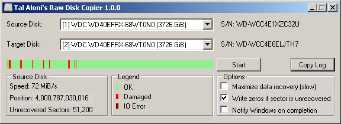
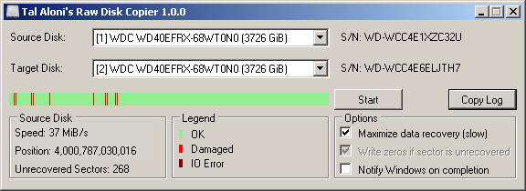

About Raw Disk Copier:
==========================
This simple utility was designed to copy the data from one hard drive to another, with the ability to handle a failing hard drive and minimize data loss.  

##### Q: What is a bad sector?  
Hard drives write data in block units (sectors), every time a hard drive update a sector, it also updates a checksum (stored immediately after the sector data). When a sector is read from your hard drive, it's expected that the sector checksum will match the sector data, if that is not a case, the hard disk knows something went wrong during the write operation, that's called a bad sector.  

##### Q: What causes bad sectors to happen?  
Power failure during write is one common reason, hard drive malfunction is another common reason.  

##### Q: How can data loss be minimized in the case of a bad sector?  
For speed reasons, copy programs (e.g. HDD Raw Copy Tool 1.10) usually read multiple sectors at a time, however, when a single bad sector is encountered, the hard drive fails the entire read operation, and the program will simply skip all of those sectors without copying them.  
When using the 'Maximize data recovery' option, Raw Disk Copier will attempt to read the data from each sector separately, so that only the data from the actual bad sectors will be lost.  

##### Q: Does this program supports hard drives larger than 2TB?  
Yes.  

##### Q: How slow is the 'Maximize data recovery' option?  
If the source hard drive does not have bad sectors at all, this option does not increase the copy time.  
The more bad sectors the source has, the more sectors has to be re-read sector-by-sector, which is a slow operation, especially in the case of bad sectors, which may trigger time consuming error-handling logic at the hard drive itself.  
In addition, the copy time may be compounded by the slowness of a malfunctioning hard drive.  

Here are pictures for demonstration:  
  
Copying a failing 4TB hard drive with 'Maximize data recovery' off - 15 hours.  
 

  
Copying the same failing 4TB hard drive with 'Maximize data recovery' on - 28.5 hours.  

Contact:
========
If you have any question, feel free to contact me.  
Tal Aloni <tal.aloni.il@gmail.com>
